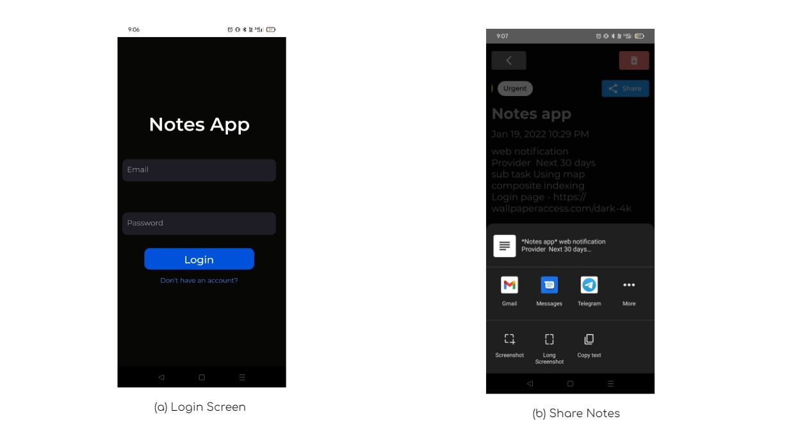
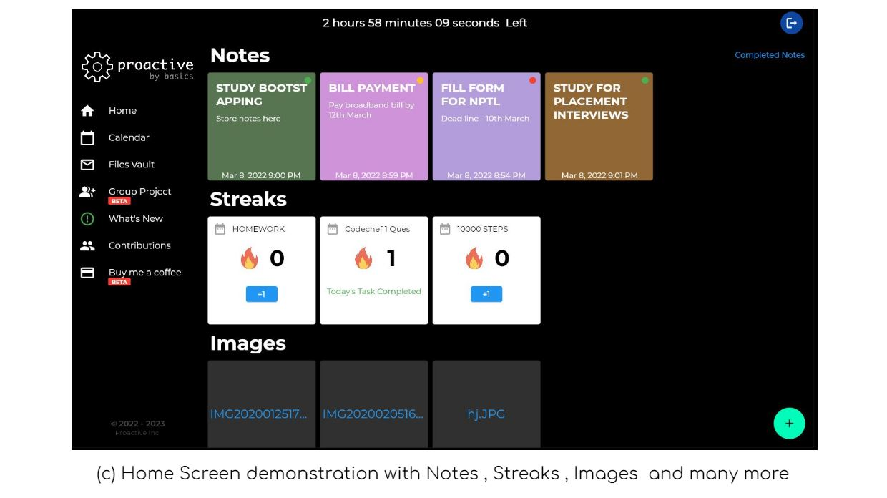
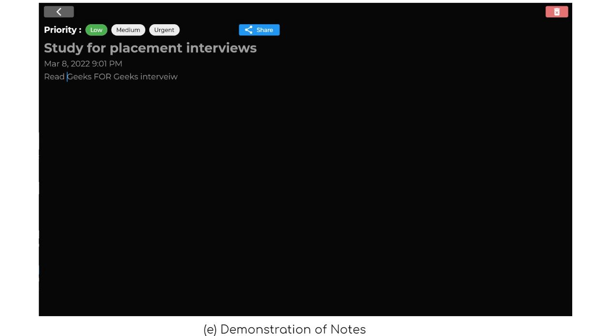

# Proactive
https://notesapp-6268f.web.app/#/
Test Login 
email - testlogin@proactive.com
password - #1234Testlogin

Proactive is a simple tool which helps you to achieve difficult Task quickly or use it has your day to day convenient tool.
ok, but how?

## What is Proactive ?

Proactive is a versatile tool designed to help you accomplish challenging tasks efficiently or serve as a convenient day-to-day productivity companion.

#How Does It Work?
Before explaining how Proactive helps, let’s address why certain goals often feel out of reach:
1) Achieving new goals requires time, patience, and consistency.
2) While starting a new journey, enthusiasm is high. However, over time, motivation fades, leading to abandoned plans.
3) The primary reason? When the effort required outweighs the joy of achievement, initial goals are forgotten.
Proactive aims to resolve these challenges through a structured approach to productivity.

#Features

1. Task/Notes
Upon opening the app, the Tasks section displays the day’s priorities.
Benefit: Minimizes decision-making time, ensuring a clear focus on daily objectives.

2. Streaks
Add streaks to tasks to track daily consistency.
Benefit: Achieving streaks provides a sense of accomplishment. Breaking a streak resets the counter to zero, encouraging persistence.

3. Files Vault
Securely save important files in a personal vault.

4. (Beta) Group Projects
Collaborate seamlessly with group members.
Share notes and files.
Chat in real-time.
Assign and track project tasks.
Benefit: Simplifies task allocation and tracking in group settings.

5. (Beta) Donate
Support Proactive through donations via Razorpay.

#Day-to-Day Use Cases
Ever faced these common issues?
Transferring files or text between devices (e.g., phone to laptop)?
Sharing data between virtual machines and local desktops?
Proactive provides a simple, effective solution for these challenges.

## Comming Soon......
Google Calendar Integration
Phone Auth
statemanagement soon..

## OVERVIEW/IMAGES

